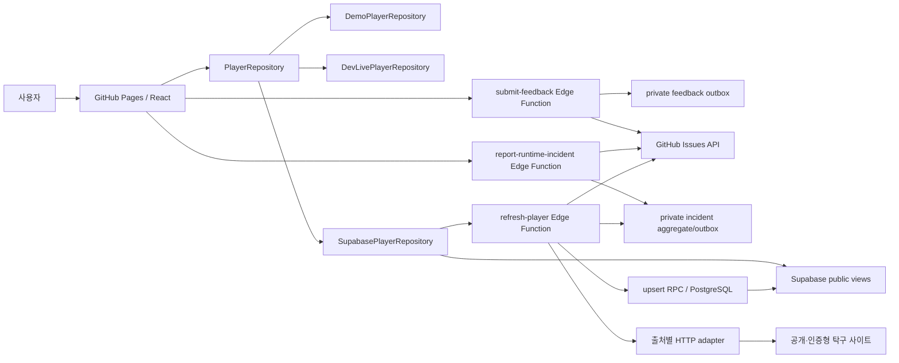

# 아키텍처

BUSU는 pnpm monorepo 하나와 Supabase managed backend로 구성한다. 별도 상시 Node API 서버를 두지 않는다. React 컴포넌트는 `PlayerRepository` 계약만 사용하고, 선택된 repository가 demo·로컬 live middleware·Supabase public API 차이를 감춘다.

Hosted Supabase는 production과 development 두 프로젝트로 분리한다. 두 환경은 같은 migration을 사용하지만 project ref, URL, publishable key, 데이터와 Edge secrets를 공유하지 않는다. Free 플랜에서는 유료 Branching 대신 두 번째 프로젝트를 사용하고, table 이름에 환경 prefix를 넣지 않는다. development에는 합성 seed만 두며 `mock` 외 출처와 live crawler를 항상 비활성화한다.

## 시스템 경계

## Workspace 책임

| Workspace                  | 책임                                                | 의존 방향                      |
| -------------------------- | --------------------------------------------------- | ------------------------------ |
| `apps/web`                 | 라우팅, 화면, TanStack Query, repository 선택       | domain을 소비                  |
| `packages/domain`          | 모델, 이름·지역·부수·입상·정렬·hash 순수 규칙       | 다른 workspace에 의존하지 않음 |
| `packages/crawler-core`    | `SourceAdapter` 계약, 오류, in-memory revision 판정 | domain을 소비                  |
| `packages/source-adapters` | 출처 fetch/parse/Zod 검증                           | domain과 crawler-core를 소비   |
| `supabase`                 | schema/RLS/views/RPC, Edge orchestration            | generated parser bundle을 소비 |

순환 의존성을 만들지 않는다. UI가 출처 HTML을 해석하거나 parser가 React 타입을 알게 하지 않는다.

## 검색 흐름

1. `SearchResultsPage`가 repository에서 저장 후보를 읽는다.
2. refresh 기능이 켜져 있으면 source catalog의 활성 출처를 구한다.
3. 활성 출처마다 별도 TanStack Query로 `requestRefresh`를 호출한다.
4. 각 출처의 완료 직후 선수 query cache를 무효화해 새 저장 결과를 반영한다.
5. 출처 하나가 실패해도 다른 query와 기존 결과는 유지한다.

현재 production refresh는 동기 Edge 요청이지만 UI에서는 활성 출처별로 분리해 실시간 진행 상태를 표현한다. 서버의 안전한 오류 코드로 시간 초과·접근 차단·구조 변경·인증 실패를 구분하며, 아이핑을 포함한 `출처 + 정규화 검색어` 단위 호출 제한은 5~60초 범위의 설정값과 1분당 4회 상한, 남은 시간을 제공한다. 같은 이름의 연속 요청만 대기시키므로 다른 이름 검색을 출처 전체 잠금으로 직렬화하지 않는다. 아이핑은 이와 별도로 짧은 DB 행 잠금으로 원자적으로 관리하는 계정 단위 분당 6회 예산을 적용해, 서로 다른 이름을 이용한 무제한 인증 요청을 막는다. 클라이언트는 호출 제한과 에어핑퐁의 명시적 `source_timeout`만 최대 2회 자동 재시도한다. 시간 초과 재시도는 최소 5초를 기다리고, 아이핑 인증 시간 초과·인증 실패·구조 변경 같은 결정적인 실패는 자동 반복하지 않는다. 그 밖의 실패는 사용자가 5초 간격·최대 3회 수동 재시도할 수 있으며 성공하면 해당 검색의 수동 재시도 횟수를 초기화한다. `refresh-status`는 저장된 refresh ID 상태를 공개 응답으로 변환한다.

Supabase Edge의 에어핑퐁 요청은 5초 제한의 단일 서버 시도만 수행하고 `source_timeout`과 `retryAfterMs=5000`을 반환한다. 브라우저가 이 메타데이터에 따라 최대 2회 다시 Edge를 호출하므로 한 번의 Edge 실행에서 장시간 대기하거나 서버 내부 재시도를 겹치지 않는다. workspace live CLI adapter의 `fetchWithRetry`는 별도 진단 경로로, 호출자 취소를 보존하면서 네트워크·시간 초과와 HTTP 408·500·502·503·504만 최대 2회 시도한다. 이 경로에서는 에어핑퐁 16초, 오케이핑퐁 10초, 아이핑 12초 이상의 제한과 250ms 선형 지연 뒤 1회 재시도를 유지한다. 408을 제외한 4xx처럼 결정적인 응답과 아이핑 로그인 POST는 자동 재시도하지 않는다.

아이핑은 로그인 화면의 서버용 `getSetCookie()` 배열, 결합 헤더, 숨은 입력값 순서로 검증된 세션 쿠키를 찾아 조회마다 임시 세션을 만들고 로그인 폼·로그아웃 표식·사람 확인 화면을 별도로 판별한다. 인증 후 참가·전국 입상·지역 입상 세 요청을 같은 세션으로 실행하되 쿠키를 저장소나 응답에 남기지 않는다. 세션 만료는 인증 실패, 사람 확인은 접근 차단, 알 수 없는 성공 화면은 구조 변경으로 분류한다. workspace adapter와 Edge Function은 같은 안전한 오류 분류를 사용하지만 호출 제한과 네트워크 재시도 정책은 각 런타임의 실행 한도에 맞게 분리한다.

## 실행 모드 선택

`apps/web/src/lib/runtimeConfig.ts`가 다음 우선순위로 repository를 선택한다.

1. test → demo
2. Vite dev + `VITE_DEV_LIVE_SEARCH=true` → local live
3. `VITE_APP_MODE=demo` 또는 Supabase URL/key 누락 → demo
4. 그 외 URL/key 존재 → Supabase

실시간 source refresh UI는 production에서 `VITE_SOURCE_REFRESH_ENABLED=true`일 때만 활성화한다.

## Supabase 공개/비공개 경계

- 검색·상세 읽기는 RLS가 적용된 `public_player_search`, `public_results`, `public_source_status` view를 사용한다. `public_player_search.division_observations`는 체계·부수별 4강 이상 입상과 나머지 참가 건수를 집계한 공개 요약이다.
- 브라우저는 publishable key만 가진다.
- `refresh-player`는 publishable key를 검증한 뒤 service role로 source 상태와 upsert RPC에 접근한다.
- 외부 HTTP는 Edge Function이 수행하고 브라우저는 출처에 직접 연결하지 않는다.
- 아이핑 자격증명은 Edge Secret에만 두고 요청마다 생성한 세션 쿠키는 조회가 끝나면 폐기한다.
- 출처 실패는 허용 목록의 `last_error_code`만 저장하고 검색어·원문 오류·쿠키·HTML은 실패 상태 RPC에 전달하지 않는다. 성공 상태는 record upsert 트랜잭션이 원자적으로 갱신하며 이전 오류 코드를 지운다.
- PAT, DB password, service role key는 프런트 build 환경에 전달하지 않는다.
- `submit-feedback`은 요청 Origin을 서버 허용 목록과 대조하고 현재 URL이 같은 Origin인지 확인한다. GitHub token은 Edge Secret에만 두고 실제 HTTP `User-Agent`를 포함한 Issue 제목·본문을 서버가 생성한다.
- feedback outbox는 submission UUID와 payload hash로 멱등성을 보장한다. 게시 완료 즉시 내용·URL·User-Agent·언어·viewport를 지우며, 결과가 모호하면 marker 조회 전에는 같은 Issue를 다시 만들지 않는다.
- 브라우저 자동 보고는 `render_error`, `uncaught_error`, `unhandled_rejection`만 받는다. 앱 버전과 query/hash가 없는 route만 전달하고 메시지·stack·사용자 입력·브라우저 식별자는 받지 않는다. Edge는 publishable key와 `RUNTIME_INCIDENT_ALLOWED_ORIGINS`를 모두 확인한다.
- 출처 자동 보고는 `source_schema_changed`, `source_auth_failed`만 대상으로 하며 refresh의 안전한 출처 코드와 parser version만 사용한다. timeout, rate limit, offline, 취소와 일반 요청 실패는 자동 Issue 대상이 아니다.
- `operational_incidents`와 관련 event·publication budget은 RLS가 켜진 service-role 전용 저장소다. 동일 allow-list metadata의 SHA-256 fingerprint를 원자적으로 집계하고 3회부터 전달 lease를 한 호출자에게만 준다. GitHub 응답이 모호하면 본문의 정확한 fingerprint marker를 검색해 기존 Issue를 조정하며 자동으로 닫지는 않는다.
- 브라우저 보고, 출처 장애 상태 기록, 집계 또는 GitHub 게시 실패는 모두 best-effort다. React fallback과 원래 출처별 안전 오류 응답을 다른 telemetry 오류로 바꾸지 않는다.

## 정규화와 revision

adapter 응답은 Zod schema를 통과한 뒤 `NormalizedRecord`가 된다. natural key hash는 논리적 동일 기록을 찾고 content hash는 소속·부수·순위·파트너 변경을 찾는다. 내용이 같으면 확인 시각만 갱신하고, 다르면 이전/다음 값과 changed fields를 revision에 남긴다.

## Edge bundle 동기화

Deno Edge 환경은 workspace import를 그대로 배포하지 않는다. `pnpm edge:sync`가 domain과 source parser를 `supabase/functions/_shared/generated/astree-parser.js` 단일 ESM으로 bundle한다.

- 기준 구현: `packages/domain`, `packages/source-adapters`
- 생성물: `supabase/functions/_shared/generated/astree-parser.js`
- 검증: workspace unit/fixture tests
- 규칙: 생성물을 직접 편집하지 않는다.

## 라우팅과 정적 호스팅

로컬 개발의 기본 asset base는 `/pingpong-busu/`이고, GitHub Pages 커스텀 도메인 `https://busu.iamdenny.com/`의 production build는 `VITE_APP_BASE_PATH=/`를 사용한다. `HashRouter`를 사용해 정적 호스팅의 직접 새로고침 404를 피한다. desktop과 mobile은 같은 semantic DOM을 유지하되 상세 기록 표현만 table/card로 바꾼다.

정적 `index.html`은 홈용 기본 title, description, canonical, Open Graph와 Twitter 메타데이터를 제공한다. React 라우트는 검색어 또는 로드된 선수 데이터에 맞춰 동일 메타데이터를 갱신하고 홈으로 돌아오면 기본값으로 복원한다. 다만 fragment는 HTTP 요청에 포함되지 않으므로 자바스크립트를 실행하지 않는 링크 미리보기 봇에는 검색·상세별 동적 값이 전달되지 않는다. 해당 요구가 생기면 서버에서 OG HTML을 생성하는 공유 URL을 별도 경계로 둔다.

루트 `package.json`의 `version`이 유일한 제품 버전이며 `YYYY.WEEK.SEQ` 형식을 사용한다. `appVersion.ts`는 이 JSON 값을 직접 가져와 형식을 검증하고 공통 `Layout` footer에 표시해 모든 라우트에서 같은 버전을 제공한다. Pages workflow는 build 성공 뒤 같은 값으로 `v{version}` 태그와 GitHub Release/자동 릴리즈 노트를 생성하며, release job이 성공한 뒤에만 deploy job을 실행한다. 다른 커밋이 이미 같은 태그를 사용하면 배포를 중단한다.

동명이인 참여 편집은 검색 결과의 같은 정규화 이름 후보에서만 시작한다. 브라우저는 사용자가 직접 입력한 하나 이상의 탁구 별칭 그룹에 명시적으로 배정한 공개 선수 ID와 자동 생성한 익명 편집자 ID만 `submit-identity-claim`에 전달한다. 구분 근거는 별도로 입력받지 않고 시스템 기본 사유를 공개 이력에 남긴다. 한 사람만 확실히 아는 경우 별칭 한 개만 반영하고 나머지는 미분류로 둘 수 있으며 후보 수에는 고정 상한을 두지 않는다. Edge Function은 별칭 길이·문자·연락처 형태, 중복 배정과 후보 이름을 다시 검증하고 익명 ID 원문을 서버 HMAC으로 변환한 뒤 service role 전용 `apply_identity_partition_internal`을 호출한다. 익명 ID는 인증 정보가 아니며 유실되어도 기능을 제한하지 않는다. 브라우저가 service role이나 내부 table 쓰기 권한을 가지지는 않는다. 후보 최근 기록은 우선 `list_identity_candidate_evidence` RPC로 읽고, RPC가 아직 배포되지 않았거나 일시 실패하면 `public_results` 공개 view를 묶음 조회해 기능을 유지한다.

참여 편집 RPC는 한 트랜잭션에서 후보 집합을 잠그고 같은 정규화 이름, 별칭 중복과 활성 상태를 검증한다. 각 별칭 그룹 안에서는 공개 기록과 출처 identity가 가장 많은 후보를 대표 선수로 안정적으로 고른 뒤 `merge_players_internal`로 이전 연결을 감사 table에 보존한다. singleton 그룹도 별칭과 이전 상태를 snapshot으로 남긴다. 공개 `list_identity_edit_history`는 개인정보와 HMAC을 제외한 변경 근거·후보별 별칭·상태만 반환한다. `revert-identity-edit`는 `revert_identity_partition_internal`을 통해 한 편집에 속한 모든 merge와 별칭을 역순으로 복구한다. 따라서 원복은 결과를 복사하거나 삭제하지 않고 `source_player_identities.player_id` 연결과 별칭을 이전 상태로 되돌리는 원자적 트랜잭션이다.

디렉터리별 변경 영향은 [codemap](codemap.md), 기능 계약은 [제품 스펙](product-spec.md)을 참고한다.
