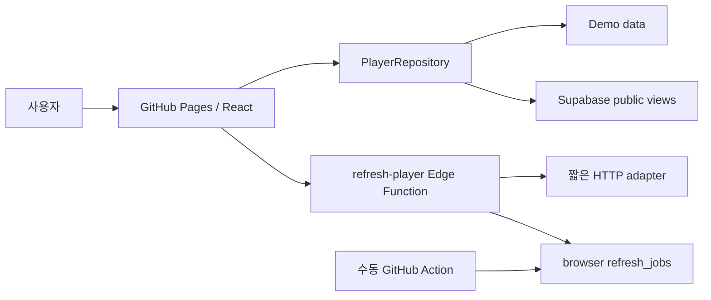

# Architecture

GitHub Pages가 React 정적 앱을 제공하고, 앱은 `PlayerRepository`만 사용합니다. 환경 변수가 없으면 `DemoPlayerRepository`, 있으면 `SupabasePlayerRepository`를 선택합니다. UI가 Supabase client를 직접 호출하지 않습니다.

검색은 stale-while-revalidate 방식입니다. 저장된 후보/기록을 먼저 표시하고 TTL이 지난 출처만 갱신합니다. 동일 query와 refresh bucket은 DB unique constraint로 중복을 막고, 로컬 Vite middleware도 in-flight promise와 6시간 cache로 중복 요청을 막습니다. 완료된 출처만 TanStack Query cache를 무효화합니다. 출처 하나가 실패해도 기존 결과와 다른 출처 상태를 유지합니다.

GitHub Pages 경로는 `/pingpong-busu/`이고 `HashRouter`로 직접 새로고침 문제를 피합니다. Edge의 Deno 제약 때문에 `pnpm edge:sync`가 workspace의 애즈트리 parser와 domain 의존성을 `_shared/generated` 단일 ESM artifact로 bundle합니다. 생성물을 수동 편집하지 않으며 workspace fixture tests가 기준입니다.
