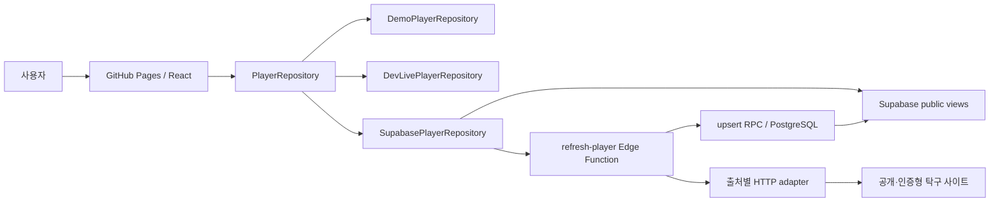

# 아키텍처

BUSU는 pnpm monorepo 하나와 Supabase managed backend로 구성한다. 별도 상시 Node API 서버를 두지 않는다. React 컴포넌트는 `PlayerRepository` 계약만 사용하고, 선택된 repository가 demo·로컬 live middleware·Supabase public API 차이를 감춘다.

## 시스템 경계

## Workspace 책임

| Workspace                  | 책임                                                | 의존 방향                      |
| -------------------------- | --------------------------------------------------- | ------------------------------ |
| `apps/web`                 | 라우팅, 화면, TanStack Query, repository 선택       | domain을 소비                  |
| `packages/domain`          | 모델, 이름·지역·부수·입상·정렬·hash 순수 규칙       | 다른 workspace에 의존하지 않음 |
| `packages/crawler-core`    | `SourceAdapter` 계약, 오류, in-memory revision 판정 | domain을 소비                  |
| `packages/source-adapters` | 출처 fetch/parse/Zod 검증                           | domain과 crawler-core를 소비   |
| `supabase`                 | schema/RLS/views/RPC, Edge orchestration            | generated parser bundle을 소비 |

순환 의존성을 만들지 않는다. UI가 출처 HTML을 해석하거나 parser가 React 타입을 알게 하지 않는다.

## 검색 흐름

1. `SearchResultsPage`가 repository에서 저장 후보를 읽는다.
2. refresh 기능이 켜져 있으면 source catalog의 활성 출처를 구한다.
3. 활성 출처마다 별도 TanStack Query로 `requestRefresh`를 호출한다.
4. 각 출처의 완료 직후 선수 query cache를 무효화해 새 저장 결과를 반영한다.
5. 출처 하나가 실패해도 다른 query와 기존 결과는 유지한다.

현재 production refresh는 동기 Edge 요청이지만 UI에서는 출처별로 분리해 실시간 진행 상태를 표현한다. `refresh-status`는 저장된 refresh ID 상태를 공개 응답으로 변환한다.

## 실행 모드 선택

`apps/web/src/lib/runtimeConfig.ts`가 다음 우선순위로 repository를 선택한다.

1. test → demo
2. Vite dev + `VITE_DEV_LIVE_SEARCH=true` → local live
3. `VITE_APP_MODE=demo` 또는 Supabase URL/key 누락 → demo
4. 그 외 URL/key 존재 → Supabase

실시간 source refresh UI는 production에서 `VITE_SOURCE_REFRESH_ENABLED=true`일 때만 활성화한다.

## Supabase 공개/비공개 경계

- 검색·상세 읽기는 RLS가 적용된 `public_player_search`, `public_results`, `public_source_status` view를 사용한다.
- 브라우저는 publishable key만 가진다.
- `refresh-player`는 publishable key를 검증한 뒤 service role로 source 상태와 upsert RPC에 접근한다.
- 외부 HTTP는 Edge Function이 수행하고 브라우저는 출처에 직접 연결하지 않는다.
- 아이핑 자격증명은 Edge Secret에만 두고 요청마다 생성한 세션 쿠키는 조회가 끝나면 폐기한다.
- PAT, DB password, service role key는 프런트 build 환경에 전달하지 않는다.

## 정규화와 revision

adapter 응답은 Zod schema를 통과한 뒤 `NormalizedRecord`가 된다. natural key hash는 논리적 동일 기록을 찾고 content hash는 소속·부수·순위·파트너 변경을 찾는다. 내용이 같으면 확인 시각만 갱신하고, 다르면 이전/다음 값과 changed fields를 revision에 남긴다.

## Edge bundle 동기화

Deno Edge 환경은 workspace import를 그대로 배포하지 않는다. `pnpm edge:sync`가 domain과 source parser를 `supabase/functions/_shared/generated/astree-parser.js` 단일 ESM으로 bundle한다.

- 기준 구현: `packages/domain`, `packages/source-adapters`
- 생성물: `supabase/functions/_shared/generated/astree-parser.js`
- 검증: workspace unit/fixture tests
- 규칙: 생성물을 직접 편집하지 않는다.

## 라우팅과 정적 호스팅

로컬 개발의 기본 asset base는 `/pingpong-busu/`이고, GitHub Pages 커스텀 도메인 `https://busu.iamdenny.com/`의 production build는 `VITE_APP_BASE_PATH=/`를 사용한다. `HashRouter`를 사용해 정적 호스팅의 직접 새로고침 404를 피한다. desktop과 mobile은 같은 semantic DOM을 유지하되 상세 기록 표현만 table/card로 바꾼다.

정적 `index.html`은 홈용 기본 title, description, canonical, Open Graph와 Twitter 메타데이터를 제공한다. React 라우트는 검색어 또는 로드된 선수 데이터에 맞춰 동일 메타데이터를 갱신하고 홈으로 돌아오면 기본값으로 복원한다. 다만 fragment는 HTTP 요청에 포함되지 않으므로 자바스크립트를 실행하지 않는 링크 미리보기 봇에는 검색·상세별 동적 값이 전달되지 않는다. 해당 요구가 생기면 서버에서 OG HTML을 생성하는 공유 URL을 별도 경계로 둔다.

디렉터리별 변경 영향은 [codemap](codemap.md), 기능 계약은 [제품 스펙](product-spec.md)을 참고한다.
