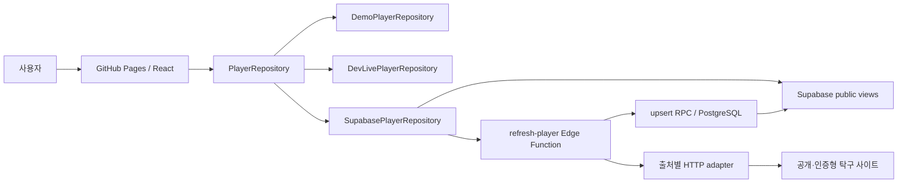

# 아키텍처

BUSU는 pnpm monorepo 하나와 Supabase managed backend로 구성한다. 별도 상시 Node API 서버를 두지 않는다. React 컴포넌트는 `PlayerRepository` 계약만 사용하고, 선택된 repository가 demo·로컬 live middleware·Supabase public API 차이를 감춘다.

## 시스템 경계

## Workspace 책임

| Workspace                  | 책임                                                | 의존 방향                      |
| -------------------------- | --------------------------------------------------- | ------------------------------ |
| `apps/web`                 | 라우팅, 화면, TanStack Query, repository 선택       | domain을 소비                  |
| `packages/domain`          | 모델, 이름·지역·부수·입상·정렬·hash 순수 규칙       | 다른 workspace에 의존하지 않음 |
| `packages/crawler-core`    | `SourceAdapter` 계약, 오류, in-memory revision 판정 | domain을 소비                  |
| `packages/source-adapters` | 출처 fetch/parse/Zod 검증                           | domain과 crawler-core를 소비   |
| `supabase`                 | schema/RLS/views/RPC, Edge orchestration            | generated parser bundle을 소비 |

순환 의존성을 만들지 않는다. UI가 출처 HTML을 해석하거나 parser가 React 타입을 알게 하지 않는다.

## 검색 흐름

1. `SearchResultsPage`가 repository에서 저장 후보를 읽는다.
2. refresh 기능이 켜져 있으면 source catalog의 활성 출처를 구한다.
3. 활성 출처마다 별도 TanStack Query로 `requestRefresh`를 호출한다.
4. 각 출처의 완료 직후 선수 query cache를 무효화해 새 저장 결과를 반영한다.
5. 출처 하나가 실패해도 다른 query와 기존 결과는 유지한다.

현재 production refresh는 동기 Edge 요청이지만 UI에서는 활성 출처별로 분리해 실시간 진행 상태를 표현한다. 서버의 안전한 오류 코드로 시간 초과·접근 차단·구조 변경·인증 실패를 구분하며, `출처 + 정규화 검색어` 단위 호출 제한은 5초 하한·1분당 4회 상한과 남은 시간을 제공한다. 서버 계정으로 로그인하는 아이핑은 행 잠금으로 직렬화한 출처 전체 60초 제한을 추가해 검색어 변경에 의한 우회를 막는다. 클라이언트는 호출 제한을 최대 2회 자동 재시도하고, 일반 실패는 사용자가 5초 간격·최대 3회 수동 재시도할 수 있다. `refresh-status`는 저장된 refresh ID 상태를 공개 응답으로 변환한다.

출처 HTTP adapter의 `fetchWithRetry`는 호출자 취소를 보존하면서 네트워크·시간 초과와 HTTP 408·500·502·503·504만 최대 2회 시도한다. 에어핑퐁은 요청당 16초, 오케이핑퐁은 10초, 아이핑은 12초 이상의 출처별 제한을 사용하고 250ms 선형 지연 뒤 한 번만 재시도한다. 408을 제외한 4xx처럼 결정적인 응답과 아이핑 로그인 POST는 자동 재시도하지 않아 접근 제한이나 인증 요청을 불필요하게 반복하지 않는다.

아이핑은 로그인 화면의 서버용 `getSetCookie()` 배열, 결합 헤더, 숨은 입력값 순서로 검증된 세션 쿠키를 찾아 조회마다 임시 세션을 만들고 로그인 폼·로그아웃 표식·사람 확인 화면을 별도로 판별한다. 인증 후 참가·전국 입상·지역 입상 세 요청을 같은 세션으로 실행하되 쿠키를 저장소나 응답에 남기지 않는다. 세션 만료는 인증 실패, 사람 확인은 접근 차단, 알 수 없는 성공 화면은 구조 변경으로 분류한다. workspace adapter와 Edge Function은 같은 분류와 제한을 유지한다.

## 실행 모드 선택

`apps/web/src/lib/runtimeConfig.ts`가 다음 우선순위로 repository를 선택한다.

1. test → demo
2. Vite dev + `VITE_DEV_LIVE_SEARCH=true` → local live
3. `VITE_APP_MODE=demo` 또는 Supabase URL/key 누락 → demo
4. 그 외 URL/key 존재 → Supabase

실시간 source refresh UI는 production에서 `VITE_SOURCE_REFRESH_ENABLED=true`일 때만 활성화한다.

## Supabase 공개/비공개 경계

- 검색·상세 읽기는 RLS가 적용된 `public_player_search`, `public_results`, `public_source_status` view를 사용한다. `public_player_search.division_observations`는 체계·부수별 4강 이상 입상과 나머지 참가 건수를 집계한 공개 요약이다.
- 브라우저는 publishable key만 가진다.
- `refresh-player`는 publishable key를 검증한 뒤 service role로 source 상태와 upsert RPC에 접근한다.
- 외부 HTTP는 Edge Function이 수행하고 브라우저는 출처에 직접 연결하지 않는다.
- 아이핑 자격증명은 Edge Secret에만 두고 요청마다 생성한 세션 쿠키는 조회가 끝나면 폐기한다.
- PAT, DB password, service role key는 프런트 build 환경에 전달하지 않는다.

## 정규화와 revision

adapter 응답은 Zod schema를 통과한 뒤 `NormalizedRecord`가 된다. natural key hash는 논리적 동일 기록을 찾고 content hash는 소속·부수·순위·파트너 변경을 찾는다. 내용이 같으면 확인 시각만 갱신하고, 다르면 이전/다음 값과 changed fields를 revision에 남긴다.

## Edge bundle 동기화

Deno Edge 환경은 workspace import를 그대로 배포하지 않는다. `pnpm edge:sync`가 domain과 source parser를 `supabase/functions/_shared/generated/astree-parser.js` 단일 ESM으로 bundle한다.

- 기준 구현: `packages/domain`, `packages/source-adapters`
- 생성물: `supabase/functions/_shared/generated/astree-parser.js`
- 검증: workspace unit/fixture tests
- 규칙: 생성물을 직접 편집하지 않는다.

## 라우팅과 정적 호스팅

로컬 개발의 기본 asset base는 `/pingpong-busu/`이고, GitHub Pages 커스텀 도메인 `https://busu.iamdenny.com/`의 production build는 `VITE_APP_BASE_PATH=/`를 사용한다. `HashRouter`를 사용해 정적 호스팅의 직접 새로고침 404를 피한다. desktop과 mobile은 같은 semantic DOM을 유지하되 상세 기록 표현만 table/card로 바꾼다.

정적 `index.html`은 홈용 기본 title, description, canonical, Open Graph와 Twitter 메타데이터를 제공한다. React 라우트는 검색어 또는 로드된 선수 데이터에 맞춰 동일 메타데이터를 갱신하고 홈으로 돌아오면 기본값으로 복원한다. 다만 fragment는 HTTP 요청에 포함되지 않으므로 자바스크립트를 실행하지 않는 링크 미리보기 봇에는 검색·상세별 동적 값이 전달되지 않는다. 해당 요구가 생기면 서버에서 OG HTML을 생성하는 공유 URL을 별도 경계로 둔다.

루트 `package.json`의 `version`이 유일한 제품 버전이며 `YYYY.WEEK.SEQ` 형식을 사용한다. `appVersion.ts`는 이 JSON 값을 직접 가져와 형식을 검증하고 홈 footer에 표시한다. Pages workflow는 build 성공 뒤 같은 값으로 `v{version}` 태그와 GitHub Release/자동 릴리즈 노트를 생성하며, release job이 성공한 뒤에만 deploy job을 실행한다. 다른 커밋이 이미 같은 태그를 사용하면 배포를 중단한다.

동명이인 참여 제보는 검색 결과의 같은 정규화 이름 후보에서만 시작한다. 브라우저는 선택한 공개 선수 ID, 사용자가 정한 숫자 4자리, 선택적 참고사항만 `submit-identity-claim`에 전달한다. Edge Function은 후보 이름을 재검증하고 숫자 원문을 서버 HMAC으로 변환한 뒤 service role 전용 RPC로 저장한다. public RLS 정책은 제보 table을 읽거나 직접 쓰는 권한을 주지 않는다. 제보 상태는 항상 검토 대기로 시작하며 identity merge와 분리된 경계다.

승인된 후보를 실제로 합칠 때는 service role 전용 `merge_players_internal`만 사용한다. 이 RPC는 같은 정규화 이름, 활성 후보, 승인 제보의 후보 집합을 다시 검증하고 출처 identity의 이전 연결을 감사 table에 먼저 기록한 다음 대상 선수로 재연결한다. `revert_player_merge_internal`은 후속 병합과 현재 연결 충돌을 검사한 뒤 저장된 연결을 복구한다. 따라서 원복은 대회 결과를 복사하거나 삭제하는 작업이 아니라 `source_player_identities.player_id` 연결을 되돌리는 트랜잭션이다.

디렉터리별 변경 영향은 [codemap](codemap.md), 기능 계약은 [제품 스펙](product-spec.md)을 참고한다.
