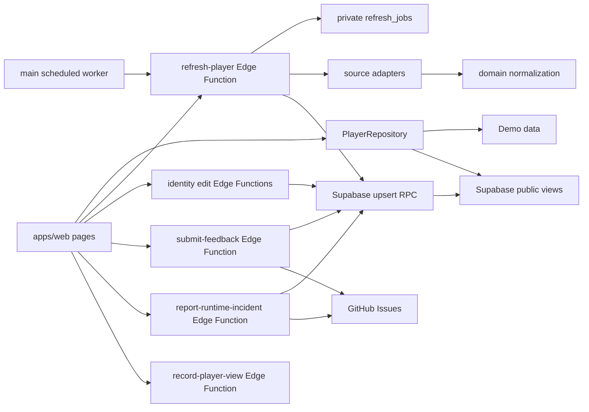

# BUSU codemap

## Runtime flow

## Directory map

| 경로                                              | 핵심 파일                                                                                                                                                                                 | 책임                                                                                                          | 변경 시 함께 확인                                     |
| ------------------------------------------------- | ----------------------------------------------------------------------------------------------------------------------------------------------------------------------------------------- | ------------------------------------------------------------------------------------------------------------- | ----------------------------------------------------- |
| `apps/web/src/pages`                              | `HomePage.tsx`, `SearchResultsPage.tsx`, `PlayerDetailPage.tsx`                                                                                                                           | 사용자 흐름과 화면 조합                                                                                       | component tests, `DESIGN.md`, product spec            |
| `apps/web/src/lib`                                | `repository.ts`, `SupabasePlayerRepository.ts`, `pageMetadata.ts`, `browserRouting.ts`, `runtime-incident-repository.ts`, `appVersion.ts`                                                 | 실행 모드, 데이터 접근, route metadata·legacy URL 이관, 오류 보고, build 버전 경계                            | runtime/unit tests, public view schema, SEO generator |
| `apps/web/src/components`                         | 검색·출처 진행·비교 컴포넌트                                                                                                                                                              | 재사용 UI와 접근성                                                                                            | component tests, CSS                                  |
| `apps/web/src/styles`                             | `global.css`                                                                                                                                                                              | token, responsive layout                                                                                      | desktop/mobile preview                                |
| `packages/domain/src`                             | `models.ts`, `division.ts`, `region.ts`, `observations.ts`                                                                                                                                | 공통 모델과 순수 도메인 규칙                                                                                  | domain tests, parser expectations, migration          |
| `packages/crawler-core/src`                       | `adapter.ts`, `memory-repository.ts`, `presentation.ts`                                                                                                                                   | adapter 계약과 revision 판정                                                                                  | crawler tests                                         |
| `packages/source-adapters/src/<source>`           | `adapter.ts`, `parser.ts`, `schema.ts`, 아이핑 `session.ts`                                                                                                                               | 출처별 fetch/parse/validate와 인증 세션 판별                                                                  | synthetic fixture, parser version, source notes       |
| `packages/source-adapters/src/resilient-fetch.ts` | `fetchWithRetry`                                                                                                                                                                          | timeout·일시적 HTTP 오류에 한정한 재시도와 호출자 취소 전파                                                   | resilient-fetch unit test, Edge 동등 구현             |
| `supabase/migrations`                             | timestamped SQL                                                                                                                                                                           | schema, RLS, public views, RPC, source catalog                                                                | rollback 영향, development/production dry-run         |
| `supabase/functions/refresh-player`               | `index.ts`                                                                                                                                                                                | 동기 출처 fetch·upsert, 아이핑 enqueue·worker drain                                                           | Edge auth, queue migration, operations docs           |
| `supabase/functions/refresh-status`               | `index.ts`                                                                                                                                                                                | refresh 공개 상태                                                                                             | repository response schema                            |
| `supabase/functions/submit-identity-claim`        | `index.ts`                                                                                                                                                                                | 참여형 동일인 연결, 익명 편집자 ID HMAC                                                                       | public history, merge RPC, abuse control              |
| `supabase/functions/revert-identity-edit`         | `index.ts`                                                                                                                                                                                | 공개 편집 원복, 익명 편집자 ID HMAC                                                                           | merge snapshot, conflict guard                        |
| `supabase/functions/submit-feedback`              | `index.ts`, `handler.ts`                                                                                                                                                                  | 익명 제보 검증, private outbox, GitHub Issue 전달                                                             | origin/auth, abuse limit, idempotency                 |
| `supabase/functions/report-runtime-incident`      | `index.ts`, `handler.ts`                                                                                                                                                                  | 브라우저 오류 allow-list 검증, private 집계와 GitHub 전달                                                     | origin/auth, fingerprint, 개인정보 비수집             |
| `supabase/functions/record-player-view`           | `index.ts`, `handler.ts`                                                                                                                                                                  | 공개 선수 ID 검증과 시간 단위 조회 집계 호출                                                                  | origin/auth, HMAC 원점, 개인정보 비수집               |
| `supabase/functions/_shared`                      | auth/http/normalize/worker-auth/request-origin/generated                                                                                                                                  | Edge 공통 경계                                                                                                | secret 노출, `pnpm edge:sync`                         |
| `fixtures/sources`                                | 출처별 합성 응답                                                                                                                                                                          | parser 회귀 입력                                                                                              | 개인정보 제거 여부                                    |
| `scripts`                                         | crawler, edge sync, DB size, `replay-migrations.ts`, `release-version.ts`, `generate-seo-pages.ts`, `seo-manifest.ts`, `seo-directory.ts`, `seo-player.ts`, `seo-guide.ts`, `seo-html.ts` | 로컬/운영 도구, migration 로컬 재생, 릴리즈 버전, 공개 선수 SEO 스냅샷과 초성별 정적 색인·부수 안내 문서 생성 | commands/operations docs, root unit tests             |
| `tests`                                           | migration contract, Edge auth, e2e, SQL integration                                                                                                                                       | workspace 밖 통합·배포 회귀 검증                                                                              | migration/workflow 변경                               |
| `.github/workflows`                               | CI, Pages, production/development Supabase, manual/scheduled crawl                                                                                                                        | 검증 → 태그/Release/노트 → Pages 배포와 환경별 backend 배포                                                   | environment variables/secrets, deployment contract    |

## Change paths

### 부수 규칙 변경

`packages/domain/src/division.ts` → domain test → source parser fixture → Edge bundle sync → DB migration → web summary/detail → product/data-model docs.

### 신규 출처 추가

source schema/parser/adapter → synthetic fixture → source code/catalog migration → Edge handler/flag → source status UI → policy/source notes/operations.

### 검색 UI 변경

page/component → component test → `global.css` → desktop/mobile preview → `apps/web/DESIGN.md` → product spec acceptance criteria.

### 동명이인 참여 편집·원복 변경

별칭 자유 입력·정규화 → 기록별 그룹 배정 UI → Edge 입력 검증/HMAC → service-role atomic partition/merge RPC → 공개 이력·후보 기록 RPC와 fallback → migration contract test → 전체 rollback SQL integration → public view의 활성 그룹·별칭 → data-model/operations 문서.

### 출처 재시도 변경

`resilient-fetch.ts`/출처 session → adapter unit·fixture → Edge 동등 구현 → per-source/query throttle migration → web 자동·수동 재시도 → crawling-policy/operations 문서.

### 아이핑 예약 수집 변경

아이핑 session fixture → `refresh_jobs` migration/RPC → worker bearer auth → `refresh-player` enqueue/drain → main schedule → queued UI → source notes/architecture/operations.

### 배포 버전 변경

루트 `package.json` version → `release-version.ts` 검증·증가 → release version unit test → Pages tag/Release gate → `appVersion.ts` JSON import → 모든 라우트의 공통 footer component test.

### 라우팅·검색 노출 변경

`browserRouting.ts`/`App.tsx` → route·legacy hash test → `pageMetadata.ts`와 component metadata → `seo-manifest.ts` 행 검증 → `generate-seo-pages.ts` 정적 HTML·`/guide/`·robots/sitemap/llms.txt → Vite `404.html` fallback → Pages fail-closed workflow → product/architecture/operations/testing 문서.

### Supabase 개발 환경 변경

`supabase/migrations`/idempotent `seed.sql` → development deployment contract → main 수동 workflow → development GitHub environment → 별도 project ref/name 검증 → mock-only source 상태 확인 → operations/testing 문서.

## Generated and local-only artifacts

- `supabase/functions/_shared/generated/astree-parser.js`: `pnpm edge:sync`로 재생성하지만 배포에 필요해 커밋한다.
- `graphify-out/`: 로컬 지식 그래프이며 재생성 가능하므로 커밋하지 않는다.
- `.busu-crawler-state.json`: fixture crawler 로컬 상태이며 커밋하지 않는다.
- `apps/web/dist/`: build 결과이며 커밋하지 않는다.
- `apps/web/dist/players/*`, `directory/*`, `guide/index.html`, `search/index.html`, `robots.txt`, `sitemap.xml`, `llms.txt`: 배포 시 공개 manifest에서 재생성되는 SEO 스냅샷이며 개별 산출물을 커밋하지 않는다.
