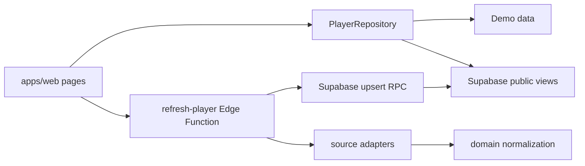

# BUSU codemap

## Runtime flow

## Directory map

| 경로                                              | 핵심 파일                                                                                                      | 책임                                                            | 변경 시 함께 확인                                     |
| ------------------------------------------------- | -------------------------------------------------------------------------------------------------------------- | --------------------------------------------------------------- | ----------------------------------------------------- |
| `apps/web/src/pages`                              | `HomePage.tsx`, `SearchResultsPage.tsx`, `PlayerDetailPage.tsx`                                                | 사용자 흐름과 화면 조합                                         | component tests, `DESIGN.md`, product spec            |
| `apps/web/src/lib`                                | `repository.ts`, `SupabasePlayerRepository.ts`, `divisionSummary.ts`, `sourceRefreshRetry.ts`, `appVersion.ts` | 실행 모드, 데이터 접근, 부수 집계, 조회 재시도, build 버전 경계 | runtime/unit tests, public view schema                |
| `apps/web/src/components`                         | 검색·출처 진행·비교 컴포넌트                                                                                   | 재사용 UI와 접근성                                              | component tests, CSS                                  |
| `apps/web/src/styles`                             | `global.css`                                                                                                   | token, responsive layout                                        | desktop/mobile preview                                |
| `packages/domain/src`                             | `models.ts`, `division.ts`, `region.ts`, `observations.ts`                                                     | 공통 모델과 순수 도메인 규칙                                    | domain tests, parser expectations, migration          |
| `packages/crawler-core/src`                       | `adapter.ts`, `memory-repository.ts`, `presentation.ts`                                                        | adapter 계약과 revision 판정                                    | crawler tests                                         |
| `packages/source-adapters/src/<source>`           | `adapter.ts`, `parser.ts`, `schema.ts`, 아이핑 `session.ts`                                                    | 출처별 fetch/parse/validate와 인증 세션 판별                    | synthetic fixture, parser version, source notes       |
| `packages/source-adapters/src/resilient-fetch.ts` | `fetchWithRetry`                                                                                               | timeout·일시적 HTTP 오류에 한정한 재시도와 호출자 취소 전파     | resilient-fetch unit test, Edge 동등 구현             |
| `supabase/migrations`                             | timestamped SQL                                                                                                | schema, RLS, public views, RPC, source catalog                  | rollback 영향, production dry-run                     |
| `supabase/functions/refresh-player`               | `index.ts`                                                                                                     | 출처 선택·안전 스위치·fetch·upsert                              | Edge auth, generated bundle, operations docs          |
| `supabase/functions/refresh-status`               | `index.ts`                                                                                                     | refresh 공개 상태                                               | repository response schema                            |
| `supabase/functions/_shared`                      | auth/http/normalize/generated                                                                                  | Edge 공통 경계                                                  | secret 노출, `pnpm edge:sync`                         |
| `fixtures/sources`                                | 출처별 합성 응답                                                                                               | parser 회귀 입력                                                | 개인정보 제거 여부                                    |
| `scripts`                                         | crawler, edge sync, DB size, `deployment-version.ts`                                                           | 로컬/운영 도구와 ISO 주차 배포 버전 생성                        | commands/operations docs, root unit tests             |
| `tests`                                           | migration contract, Edge auth, e2e, SQL integration                                                            | workspace 밖 통합·배포 회귀 검증                                | migration/workflow 변경                               |
| `.github/workflows`                               | CI, Pages, Supabase, manual crawl                                                                              | 배포·운영 자동화와 `VITE_APP_VERSION` 주입                      | repository variables/secrets, deployment version test |

## Change paths

### 부수 규칙 변경

`packages/domain/src/division.ts` → domain test → source parser fixture → Edge bundle sync → DB migration → web summary/detail → product/data-model docs.

### 신규 출처 추가

source schema/parser/adapter → synthetic fixture → source code/catalog migration → Edge handler/flag → source status UI → policy/source notes/operations.

### 검색 UI 변경

page/component → component test → `global.css` → desktop/mobile preview → `apps/web/DESIGN.md` → product spec acceptance criteria.

### 동명이인 병합·원복 변경

merge audit migration/RPC → service-role 권한 → migration contract test → rollback SQL integration → public view의 병합 선수 제외 → data-model/operations 문서.

### 출처 재시도 변경

`resilient-fetch.ts`/출처 session → adapter unit·fixture → Edge 동등 구현 → per-source/query throttle migration → web 자동·수동 재시도 → crawling-policy/operations 문서.

### 배포 버전 변경

`scripts/deployment-version.ts` → ISO 주차·순번 unit test → Pages workflow build env → `appVersion.ts` 형식 검증 → 홈 footer component test.

## Generated and local-only artifacts

- `supabase/functions/_shared/generated/astree-parser.js`: `pnpm edge:sync`로 재생성하지만 배포에 필요해 커밋한다.
- `graphify-out/`: 로컬 지식 그래프이며 재생성 가능하므로 커밋하지 않는다.
- `.busu-crawler-state.json`: fixture crawler 로컬 상태이며 커밋하지 않는다.
- `apps/web/dist/`: build 결과이며 커밋하지 않는다.
