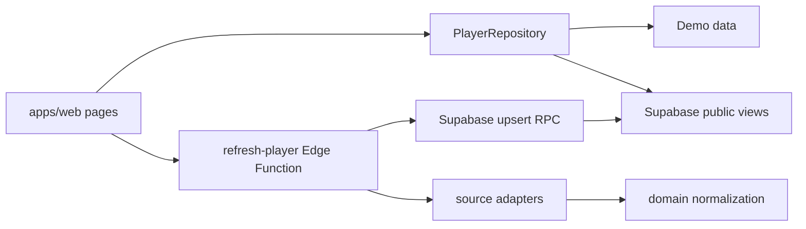

# BUSU codemap

## Runtime flow

## Directory map

| 경로 | 핵심 파일 | 책임 | 변경 시 함께 확인 |
| --- | --- | --- | --- |
| `apps/web/src/pages` | `HomePage.tsx`, `SearchResultsPage.tsx`, `PlayerDetailPage.tsx` | 사용자 흐름과 화면 조합 | component tests, `DESIGN.md`, product spec |
| `apps/web/src/lib` | `repository.ts`, `runtime.ts`, `SupabasePlayerRepository.ts` | 실행 모드와 데이터 접근 경계 | runtime tests, public view schema |
| `apps/web/src/components` | 검색·출처 진행·비교 컴포넌트 | 재사용 UI와 접근성 | component tests, CSS |
| `apps/web/src/styles` | `global.css` | token, responsive layout | desktop/mobile preview |
| `packages/domain/src` | `models.ts`, `division.ts`, `region.ts`, `observations.ts` | 공통 모델과 순수 도메인 규칙 | domain tests, parser expectations, migration |
| `packages/crawler-core/src` | `adapter.ts`, `memory-repository.ts`, `presentation.ts` | adapter 계약과 revision 판정 | crawler tests |
| `packages/source-adapters/src/<source>` | `adapter.ts`, `parser.ts`, `schema.ts` | 출처별 fetch/parse/validate | synthetic fixture, parser version, source notes |
| `supabase/migrations` | timestamped SQL | schema, RLS, public views, RPC, source catalog | rollback 영향, production dry-run |
| `supabase/functions/refresh-player` | `index.ts` | 출처 선택·안전 스위치·fetch·upsert | Edge auth, generated bundle, operations docs |
| `supabase/functions/refresh-status` | `index.ts` | refresh 공개 상태 | repository response schema |
| `supabase/functions/_shared` | auth/http/normalize/generated | Edge 공통 경계 | secret 노출, `pnpm edge:sync` |
| `fixtures/sources` | 출처별 합성 응답 | parser 회귀 입력 | 개인정보 제거 여부 |
| `scripts` | crawler, edge sync, DB size | 로컬/운영 도구 | commands/operations docs |
| `.github/workflows` | CI, Pages, Supabase, manual crawl | 배포·운영 자동화 | repository variables/secrets |

## Change paths

### 부수 규칙 변경

`packages/domain/src/division.ts` → domain test → source parser fixture → Edge bundle sync → DB migration → web summary/detail → product/data-model docs.

### 신규 출처 추가

source schema/parser/adapter → synthetic fixture → source code/catalog migration → Edge handler/flag → source status UI → policy/source notes/operations.

### 검색 UI 변경

page/component → component test → `global.css` → desktop/mobile preview → `apps/web/DESIGN.md` → product spec acceptance criteria.

## Generated and local-only artifacts

- `supabase/functions/_shared/generated/astree-parser.js`: `pnpm edge:sync`로 재생성하지만 배포에 필요해 커밋한다.
- `graphify-out/`: 로컬 지식 그래프이며 재생성 가능하므로 커밋하지 않는다.
- `.busu-crawler-state.json`: fixture crawler 로컬 상태이며 커밋하지 않는다.
- `apps/web/dist/`: build 결과이며 커밋하지 않는다.
